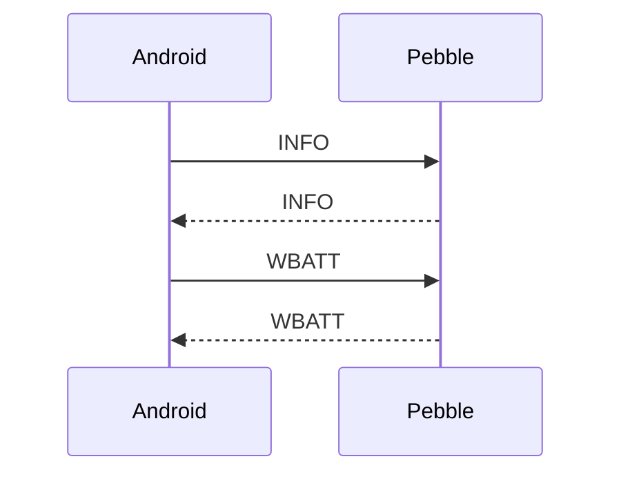
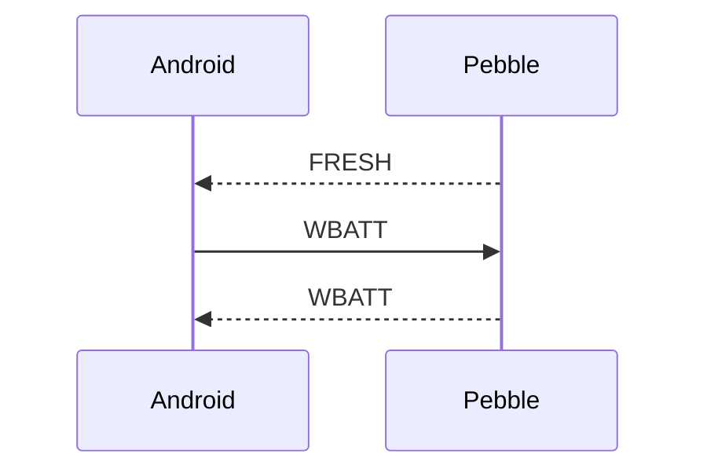

# Dolbom Protocol

The Dolbom protocol relies on
[PebbleKit Android](https://developer.rebble.io/docs/).
The protocol consists in exchanging
*Dictionary* data structures, which are lists of key/value pairs of various types.

On the Android side, this is implemented by the 
[PebbleDictionary](https://developer.rebble.io/docs/pebblekit-android/com/getpebble/android/kit/util/PebbleDictionary/)
class, and on the Pebble side, the
[Dictionary](https://developer.rebble.io/docs/c/Foundation/Dictionary/)
class.

## Protocol constants

### Dictionary keys

| Id | Android(`DictKey`) | Type    | Pebble(`enum`)      | Type(bytes) | Actual range        | Meaning                                       |
|----|--------------------|---------|---------------------|-------------|---------------------|-----------------------------------------------|
| 1  | `MSG_TYPE`         | Byte    | `KEY_MSG_TYPE_I8`   | Signed(1)   |                     | See below                                     |
| 2  | `TZ_MIN`           | Short   | `KEY_TZ_MINS_I16`   | Signed(2)   | -1439 to +1439      | Number of minutes difference of Away timezone |
| 3  | `PHONE_DND`        |         | `KEY_PHONE_DND_I8`  | Signed(1)   | 0 or 1              |                                               |
| 4  | `PHONE_BATT`       | Byte    | `KEY_PHONE_BATT_I8` | Signed(1)   | 0 to 100            | Phone battery level (%)                       |
| 5  | `PHONE_CHG`        | Boolean | `KEY_PHONE_CHG_I8`  | Signed(1)   | 0 or 1              | Phone plugged?                                |
| 6  | `NET`              | Byte    | `KEY_NET_I8`        | Signed(1)   | 0, 2, 3, 4, 5       | Cell network type                             |
| 7  | `WIFI`             | String  | `KEY_WIFI_S20`      | String(20)  | up to 20 bytes      | SSID                                          |
| 8  | `BTID`             | String  | `KEY_BTID_S20`      | String(20)  | up to 20 bytes      | Connected Bluetooth device name               |
| 9  | `BTC`              | Byte    | `KEY_BTC_I8`        | Signed(1)   | 0 to 100            | Bluetooth device's battery level              |
| 10 | `NOTI`             | String  | `KEY_NOTI_S16`      | String(16)  | up to 15 characters | Indicators                                    |
| 11 | `ACTION`           | Byte    | `KEY_ACTION_I8`     | Signed(1)   |                     | See below                                     |
| 12 | `MODEL`            | Byte    | `KEY_MODEL_I8`      | Signed(1)   |                     | Watch model                                   |
| 13 | `FW_VERSION`       | ULong   | `KEY_VERSION_U32`   | Unsigned(4) |                     | Watch firmware version                        |
| 14 | `WATCH_BATT`       | Byte    | `KEY_WBATT_I8`      | Signed(1)   | 0 to 100            | Watch battery level (%)                       |
| 15 | `WATCH_PLUG`       | Boolean | `KEY_WPLUG_I8`      | Signed(1)   | 0 or 1              | Watch plugged?                                |
| 16 | `WATCH_CHG`        | Boolean | `KEY_WCHG_I8`       | Signed(1)   | 0 or 1              | Watch charging?                               |

### Message types

| Id | Direction | Android(`MsgType`) | Pebble(`msg_type_t`) | Extras     | Notes                        |
|----|-----------|--------------------|----------------------|------------|------------------------------|
| 1  | P to W    | `INFO`             |                      | none       | Request for info             |
|    | W to P    |                    | `MSG_INFO`           | 2, 12, 13  | Response                     |
| 2  | P to W    | `TZ`               | `MSG_TZ`             | 2          | Set Away timezone            |
| 3  |           | `PHONE_DND`        | `MSG_PHONE_DND`      | 3          |                              |
| 4  | P to W    | `PHONE_CHG`        | `MSG_PHONE_CHG`      | 4, 5       | Phone's battery              |
| 5  | P to W    | `NET`              | `MSG_NET`            | 6          | Cell status                  |
| 6  | P to W    | `WIFI`             | `MSG_WIFI`           | 7          | WiFi SSID                    |
| 7  | P to W    | `BT`               | `MSG_BT`             | 8, 9       | Connected BT device          |
| 8  | P to W    | `NOTI`             | `MSG_NOTI`           | 10         | Indicators                   |
| 9  | P to W    | `WBATT`            | `MSG_WBATT`          | none       | Request watch battery status |
|    | W to P    |                    |                      | 14, 15, 16 | Response                     |
| 10 | W to P    | `ACTION`           | `MSG_ACTION`         | 11         | Trigger Phone action         |
| 11 | W to P    | `FRESH`            | `MSG_FRESH`          | 2, 12, 13  | Watch restarted              |

### Action types

| ID | Meaning                 |
|----|-------------------------|
| 1  | Toggle DND              |
| 2  | Find my phone           |
| 3  | Clear sticky indicators |

## Lifecycle

On startup, the Phone initiates the following exchange:

When the Phone's watchface restarts, it initiates the following:

Once the connection is stable, ongoing information is exchanged:

- from Phone to Watch: 4, 5, 6, 7, 8

- from Watch to Phone: 9, 10
